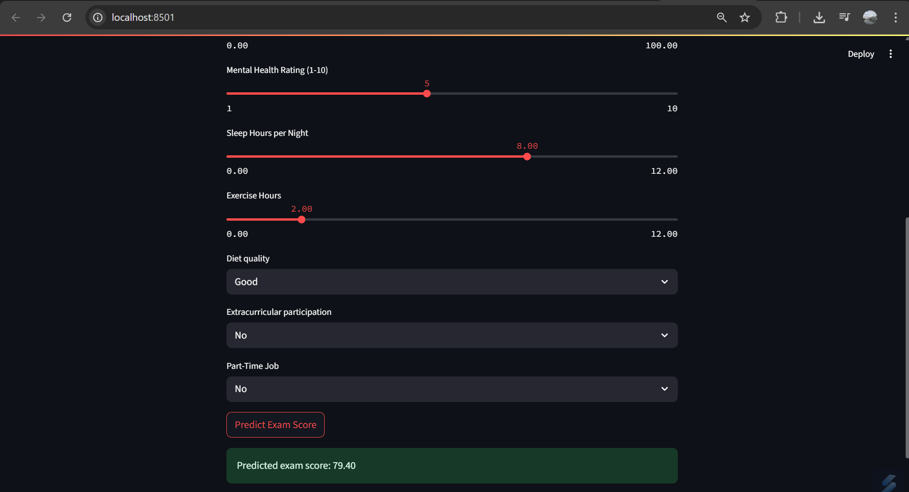

# 📊 Student Performance Predictor

This project predicts student exam scores based on various lifestyle and behavioral inputs using a machine learning model, and serves a simple UI through **Streamlit**.

## 🔍 Overview

The workflow consists of the following stages:

1. **EDA (Exploratory Data Analysis)**
2. **Data Preprocessing**
3. **Model Training**
4. **Streamlit Web Application Deployment**

---

## 🧪 1. Exploratory Data Analysis (EDA)

Key insights were derived using:
- Distribution analysis of numerical features (like study hours, sleep, attendance).
- Correlation heatmaps to understand feature influence on exam scores.
- Outlier detection using IQR methods and visual analysis.

---

## 🧼 2. Data Preprocessing

Performed steps included:
- Encoding categorical variables:
  - `Diet` → ordinal encoded (`Good`=3, `Fair`=2, `Poor`=1)
  - `Extracurricular` and `Part-Time Job` → binary encoded (`Yes`=1, `No`=0)
- Scaling or normalization was **not required** due to the nature of the model used.
- NaN or missing values were handled using mode imputation.

---

## 🧠 3. Model Training

- **Algorithm Used**: A regression model from `scikit-learn` (e.g., Linear Regression, Random Forest, or similar).
- **Target Variable**: Final exam score (0–100 scale).
- **Model Saving**: Trained model serialized using `joblib` to `model1.pkl`.

---

## 🌐 4. Streamlit App

A lightweight front-end is implemented using Streamlit in `app.py`.

### Features:
- Users input:
  - Study, Netflix, Social Media, and Sleep Hours
  - Attendance
  - Mental Health rating
  - Diet, Exercise, Extracurricular, Part-Time Job info
- Instant prediction of the student’s exam score using the trained model.

---

## 🚀 How to Run

### 1. Clone the Repository

```bash
git clone https://github.com/aishani-s20/Student_Performance_Predictor.git
cd student-performance-predictor
```

### 2. Install Dependencies

```bash
pip install -r requirements.txt
```

> **Note**: You do not need to install `pandas` or `seaborn`, as EDA is already handled in the notebook and not needed for app runtime.

### 3. Launch the Streamlit App

```bash
streamlit run app.py
```

## 🖼️ Streamlit UI Preview



---

## 📁 File Structure

```
├── student_performace_predictor.ipynb   # EDA + Preprocessing + Model training
├── app.py                               # Streamlit interface
├── model1.pkl                           # Trained model
├── requirements.txt                     # Dependencies
└── README.md                            # Project documentation
```

---

## ✅ Future Improvements

- Add cross-validation and hyperparameter tuning
- Enhance UI with charts and feedback
- Deploy the app using Streamlit Cloud or Hugging Face Spaces

---

## 🙋‍♀️ Author

Aishani Shreya – [LinkedIn](https://linkedin.com/in/your-profile)
